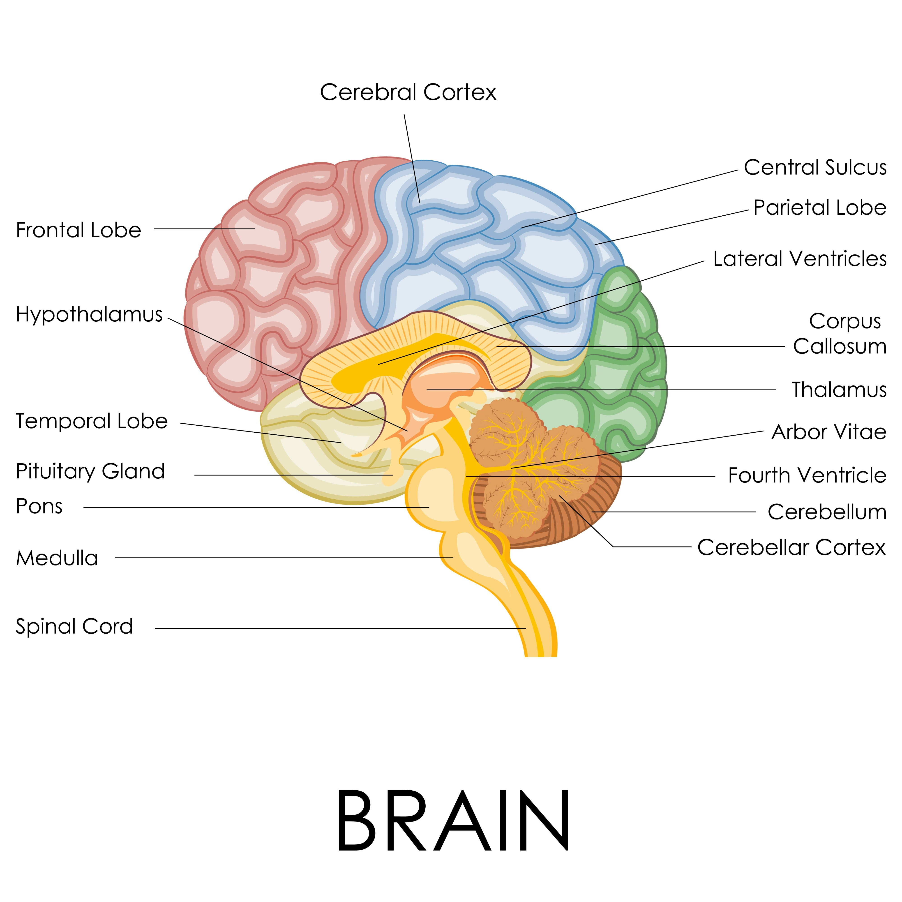

# Human Agent

<p align="center">
  
</p>

> **"The agent should think like you, correct like you, and become you."**

Human Agent is a personal AI coding agent built on a radical premise: **the best AI assistant isn't generic — it learns you**. Every line of code you reject, every pattern you prefer, every habit you have becomes part of its internal model. Over time, it stops being a tool and starts being an extension of how you think.

---

## The Brain Behind It

Human Agent's architecture mirrors the structure of the human brain:

| Brain Region | Agent Component | Function |
|---|---|---|
| **Prefrontal Cortex** | Agent Loop | Executive decisions — orchestrates thinking, planning, tool use |
| **Amygdala** | Self-Correction | Instant threat detection, fear/escape responses to errors |
| **Hippocampus** | Taste Memory | Long-term storage of your patterns, preferences, lessons learned |
| **Cerebellum** | Tool Execution | Muscle memory of skills — fast, automated, precise |
| **Brain Stem** | Sandbox | Autonomic functions — isolated, protected, self-contained |

The result: an agent that doesn't just execute tasks — it **feels** when something is wrong, **remembers** what you like, and **adapts** without being told twice.

---

## What Makes It Different

**Generic agents** vs **Human Agent**:

| | Generic Agent | Human Agent |
|---|---|---|
| **Memory** | None across sessions | Your taste persists forever |
| **Mistakes** | Fail and stop | Analyze → learn → retry |
| **Learning** | Needs explicit feedback | Extracts patterns from failure |
| **Style** | One-size-fits-all | Writes in *your* voice |
| **Safety** | Generic allowlist | Amygdala threat detection |

---

## Core Systems

### Taste Memory (Hippocampus)
Your preferences are encoded as **taste entries** — patterns the agent retrieves before every task. Categories include code style, naming conventions, architecture preferences, verbosity levels, and workflow habits. The more you use it, the more it sounds like you.

### Self-Correction (Amygdala)
When code fails, the amygdala fires. The agent doesn't just report the error — it extracts the lesson, updates the taste profile, and retries with the fix. The same mistake is never made twice.

### Threat Detection (Amygdala / Brain Stem)
Pre-execution safety scan blocks dangerous patterns:
- `rm -rf /` — root deletion
- Fork bombs, pipe-to-shell downloads
- SQL DROP without WHERE, unconditional deletes
- `eval`, `exec` in untrusted contexts

Untrusted code runs in an isolated Docker container: no network, memory capped at 256MB, PID limits, ephemeral filesystem.

### Tool Execution (Cerebellum)
Tools are the agent's motor system. Register once, execute fast:
- **Read / Write / Edit** — file operations
- **Glob / Grep** — code search
- **Bash** — command execution (sandboxed)

---

## Quick Start

```bash
git clone https://github.com/YoungYang963/human-agent.git
cd human-agent
bun install
cp .env.example .env   # configure your LLM API

./run.sh init           # initialize your identity
./run.sh "say hi"      # first contact
```

---

## Architecture

```
User Input
    ↓
Prefrontal Cortex (Agent Loop)
    ├── Check Taste Memory (Hippocampus)
    ├── Plan Tool Sequence (Cerebellum)
    └── Execute Tools (Sandbox / Brain Stem)
    ↓
Self-Correction Loop (Amygdala)
    ├── Verify Result
    ├── Extract Lesson → Update Taste
    └── Retry or Return
    ↓
Human-Aware Output
```

---

## The Taste Profile

Stored at `~/.myagent/taste/profile.json`:

```json
{
  "userId": "default",
  "entries": [
    {
      "category": "code_style",
      "pattern": "early returns",
      "rule": "Use early returns to avoid deeply nested conditionals",
      "example": "if (!user) return err; // never nested if-else pyramids",
      "usageCount": 12
    }
  ],
  "totalCorrections": 47
}
```

The agent doesn't just follow rules — it understands **why** you prefer things, then generalizes.

---

## Why This Architecture

Most AI coding tools are **stateless functions**: input in, output out, nothing learned. Human Agent is a **cognitive system** — it has attention (what to focus on), memory (what you prefer), fear (what to avoid), and learning (how to get better).

This isn't anthropomorphism for its own sake. It's a architectural bet: the patterns that make human cognition efficient — habits, threat detection, memory consolidation — are the same patterns that make an agent reliable.

---

Built by [Young Yang](https://github.com/YoungYang963) · MIT License
